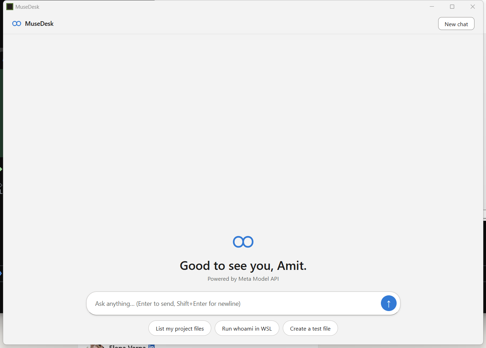

# MuseDesk

A Claude Cowork-style desktop agent for Windows — a native app that chats with Meta's models and can **read/write your files, run shell commands, and execute commands in WSL**, with every sensitive action gated behind an explicit Approve/Deny prompt.

Built with [Tauri v2](https://tauri.app/) (Rust backend, plain HTML/JS frontend). Small, fast, no Electron.



> **Status:** working demo. The Meta API backend is implemented and ready, but Meta had not yet enabled pay-as-you-go API key creation at the time of writing — so the app currently runs on a **local-CLI backend** that uses your own `muse` CLI subscription as the reasoning engine. Flip one env var to switch backends (see below).

---

## Features

- **Chat with tool use** — the model can call tools and show you exactly what it's doing as cards in the chat: `read_file`, `list_dir`, `write_file`, `shell`, `wsl`.
- **Approval gating** — reads are free; writes, shell commands, and WSL commands pop an **Approve / Deny** card. Denied actions are never executed and never retried.
- **WSL bridge** — run Linux commands in your default distro straight from the chat (`whoami` → `manager`). Stateless by design: every call re-establishes directory and context.
- **Two model backends** — direct Meta Model API (default), or local CLI for demos before your API key arrives.
- **Native Windows UI** — Copilot-style centered chat, Fluent design, light theme.

## Quick start (Windows)

**Prerequisites**

| Tool | How |
|---|---|
| Node.js LTS (24+) | `winget install OpenJS.NodeJS.LTS` |
| Rust 1.98+ | `rustup` from [rustup.rs](https://rustup.rs/) |
| VS 2022 Build Tools | `winget install Microsoft.VisualStudio.2022.BuildTools`, C++ workload |
| WebView2 | ships with Windows 10/11 |

**Run in dev**

```powershell
# from the project root
.\src-tauri\dev-local.bat
```

`dev-local.bat` handles the three Windows build gotchas for you (see *Troubleshooting*): it strips the GNU-coreutils `link.exe` shadowing from `PATH`, loads `vcvarsall x64`, redirects linker temp files to a project-local dir, serves the frontend on `:1420`, and boots with `MUSED_BACKEND=local-cli` and no Meta key required.

**Build the installer**

```powershell
# in a "x64 Native Tools" prompt, or after vcvarsall x64:
npx tauri build
```

Installers land in `src-tauri\target\release\bundle\`:
- `MuseDesk_0.1.0_x64-setup.exe` (NSIS)
- `MuseDesk_0.1.0_x64_en-US.msi`

## Configuration

| Variable | Purpose | Default |
|---|---|---|
| `META_API_KEY` | Pay-as-you-go key for the Meta Model API | — |
| `META_BASE_URL` | API endpoint | `https://api.meta.ai/v1` |
| `MUSED_MODEL` | Model name | `muse-spark-1.3` |
| `MUSED_BACKEND` | `meta-api` or `local-cli` | `meta-api` |

**`meta-api`** — direct HTTPS calls to the Meta Model API with streaming tokens. Needs `META_API_KEY`. This is the production path.

**`local-cli`** — demo path: spawns your locally authenticated `muse` CLI as the reasoning engine (no API key needed). The CLI is constrained to *reasoning only* — it returns plain text plus a strict JSON `{text, tool_calls}` schema, and all tool execution stays inside the app's Rust backend with approvals enforced. Expect ~30–60s per turn, delivered as one block (no token streaming). Note: prompts pass through your CLI subscription session.

## Tools & approval model

| Tool | What it does | Needs approval |
|---|---|---|
| `read_file` | Read a file's contents | No |
| `list_dir` | List a directory | No |
| `write_file` | Create/overwrite a file | **Yes** |
| `shell` | Run a Windows command | **Yes** |
| `wsl` | Run a command in WSL (Ubuntu) | **Yes** |

Unknown tools fail closed. There is no `--yolo` anywhere in this codebase — approvals are structural, not optional.

## WSL bridge conventions

The `wsl` tool shells out to `wsl.exe -d Ubuntu -e bash -lc <command>` with exact argv (no PowerShell re-quoting — that was a real bug once). Rules the agent prompt enforces:

- Every call is **stateless** — `cd` and restore context each time.
- Prefer `conda run -n <env> …` over activating environments.
- `bash -lc`, never `bash -ic`.
- Keep the tool descriptions honest: the model must not assume persistent shell state.

## Project structure

```
src/                  # Frontend: index.html, styles.css, main.js (plain, no framework)
src-tauri/
  src/
    main.rs           # Tauri commands, event wiring
    agent.rs          # Agent loop: prompt → tool calls → approvals → results
    api.rs            # ModelBackend enum: Meta HTTP client + LocalCli client
    tools.rs          # Tool implementations (fs, shell, WSL bridge)
    approvals.rs      # Approval matrix (unit-tested)
  capabilities/       # Tauri v2 permission sets (frontend event listening lives here)
  icons/              # App icons (icon.ico, multi-size)
  dev-local.bat       # One-shot dev launcher (env fixes + local-cli backend)
```

## Troubleshooting (Windows build gotchas)

1. **GNU `link.exe` shadows the MSVC linker** — if you installed GNU coreutils, its `link.exe` wins on `PATH` and the Rust build fails cryptically. Strip `C:\Program Files\coreutils\bin` from `PATH` in the build shell, then run `vcvarsall.bat x64`.
2. **`LNK1104`: linker can't write temp files** — `link.exe` sometimes can't write its `lnk{GUID}.tmp` files to `%TEMP%` from a plain shell. Redirect `TMP`/`TEMP` to a project-local dir (`.build-tmp/`).
3. **Bundler: "Couldn't find a .ico icon"** — `tauri.conf.json` must point `bundle.icon` at a real `.ico`, not an empty array.
4. **Blank UI after frontend changes** — WebView2 aggressively caches the dev frontend; the dev HTML uses `?v=` cache-busters on stylesheet/script links. If in doubt, clear the WebView2 dev-profile cache.
5. **`event.listen not allowed` in the console** — the capability file in `src-tauri/capabilities/` must grant `core:event:allow-listen`; without it the UI renders nothing even though the backend runs.

## Roadmap

- [ ] Live end-to-end test against the Meta Model API once pay-as-you-go keys are available
- [ ] Token streaming in `local-cli` mode
- [ ] Chat history / multi-session sidebar
- [ ] Packaged auto-updates via Tauri updater

## License

MIT — do what you like with it.
